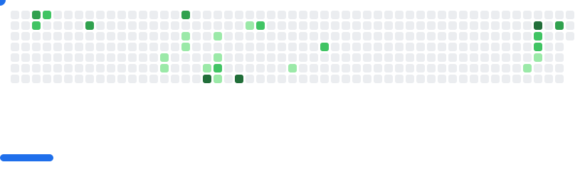

<p align="center">
  <a href="https://github.com/DenverCoder1/readme-typing-svg">
    
  </a>
</p>

---

### About Me

```js
const khanhnq = {
  name: "Nguyen Quang Khanh",
  role: "Frontend Developer",
  tools: ["React", "Tailwind", "Figma", "Node.js"],
  passion: "Crafting smooth user experiences & aesthetic interfaces",
  motto: "Design with empathy. Code with clarity.",
};
```

### 🌐 Connect with Me

<p>
  <a href="https://instagram.com/knq_30" target="_blank" rel="noopener noreferrer">
    
  </a>
  <a href="https://facebook.com/jinjin135" target="_blank" rel="noopener noreferrer">
    
  </a>
  <a href="https://linkedin.com/in/khanhnqse-3oo32003" target="_blank" rel="noopener noreferrer">
    
  </a>
   <a href="https://quangkhanh.vercel.app/" target="_blank" rel="noopener noreferrer">
    
  </a>
</p>

---


<div align="center">
  <picture>
    <source media="(prefers-color-scheme: dark)" srcset="images/breakout-dark.svg" />
    <source media="(prefers-color-scheme: light)" srcset="images/breakout-light.svg" />
    
  </picture>
</div>

### ✨ Quote I Live By

> _"Creativity is intelligence having fun." — Albert Einstein_

---

